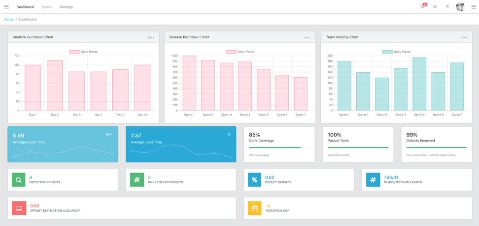

# Innometrics macOS collector

> macOS client for Innometrics

Here you can find the details on how to download and install InnoMetrics on macOS!

## Installation

macOS:

1. Download the macOS Innometrics installer from [innometrics.ru](https://innometrics.ru/#innometrics-subscribe).
2. If you receive an error that the App is from an unidentified developer, please follow [this](https://support.apple.com/en-gb/guide/mac-help/mh40616/mac) guide to resolve the issue.
3. Drag Innometrics application to the `Applications` folder.

## Getting up & running

Ask your supervisor or your manager about your credentials. Once you run the app, it will pop open in the status bar (at the top). Clicking on the icon and then clicking on `Click to Log in` will open a window so you can input your credentials.

After clicking on `Log In`, the collector should automatically start working. Clicking on the app icon again will pop open a menu where you can see all the details about your session.

## Most Recent Release

- 3.0.0
  - ADD: energy metrics to all running processes
  - CHANGE: activities do not contain energy metrics
  - CHANGE: server transmission frequency

## Dev Team

Dragos Strugar – [@strudra](https://twitter.com/strudra) – d.strugar@innopolis.ru

Copyright (c) 2020 Innopolis University - All rights reserved.
